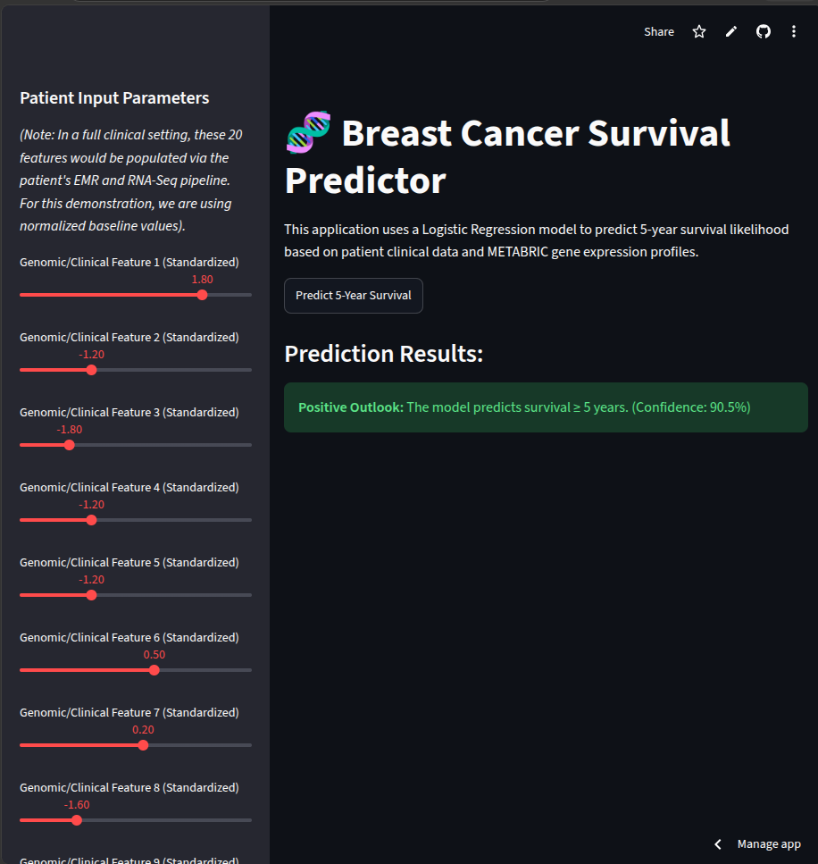

# 🧬 Predictive Modeling of Breast Cancer Survival Outcomes

## 📖 Project Description
This project develops an end-to-end machine learning pipeline to predict 5-year survival outcomes for breast cancer patients. By combining clinical metadata with high-dimensional METABRIC gene expression profiles, this model assists in clinical decision-making. The project includes extensive data cleaning, exploratory data analysis, feature engineering (including a novel `tumor_burden_index`), and algorithm tuning. The final deployed model is accessible via an interactive web dashboard.

## 👥 Team Member
* Sara Elganzory

## 🔗 Critical Links
* **Live Web Application:** https://bioinformatics-ml-final-project-gzvmt4ilpr7zo6wm8bkkku.streamlit.app/
* **Demo Video Presentation:** [Insert your Video Link Here]

## 📊 Dataset Source
The dataset used is the Breast Cancer Gene Expression Profiles (METABRIC). Due to its size, it is not hosted directly in this repository. 
* **Download Link / Initial Source:** [METABRIC on Kaggle](https://www.kaggle.com/datasets/raghadalharbi/breast-cancer-gene-expression-profiles-metabric)

## 💻 How to Run the Project Locally
1. Clone this repository:
   `git clone https://github.com/Sara-elganzory/Bioinformatics-ML-Final-Project.git`
2. Navigate to the deployment folder:
   `cd deployment`
3. Install the required dependencies:
   `pip install -r requirements.txt`
4. Run the Streamlit web application:
   `streamlit run app.py`

## 📈 Results & Output
* **Winning Model:** Tuned Logistic Regression
* **Evaluation Metrics:** * Precision: 0.78
  * Recall: 0.98

